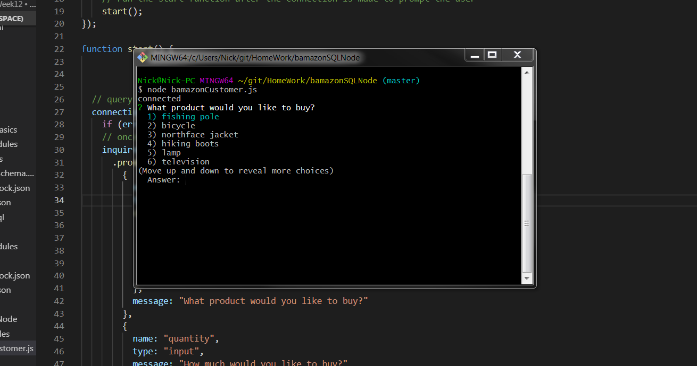
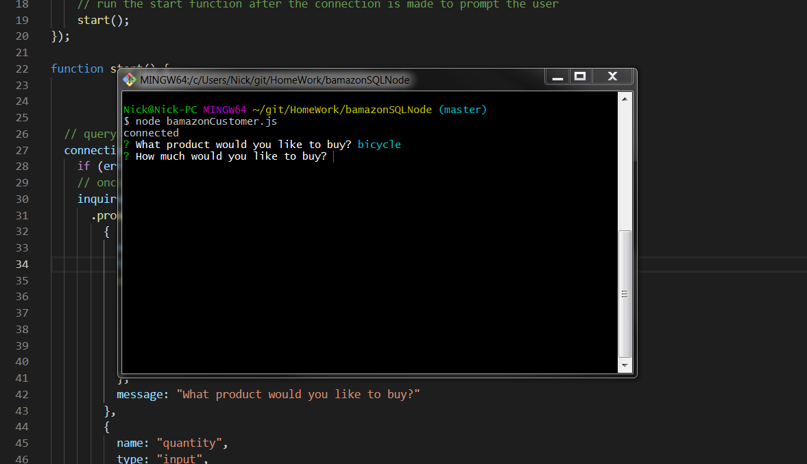
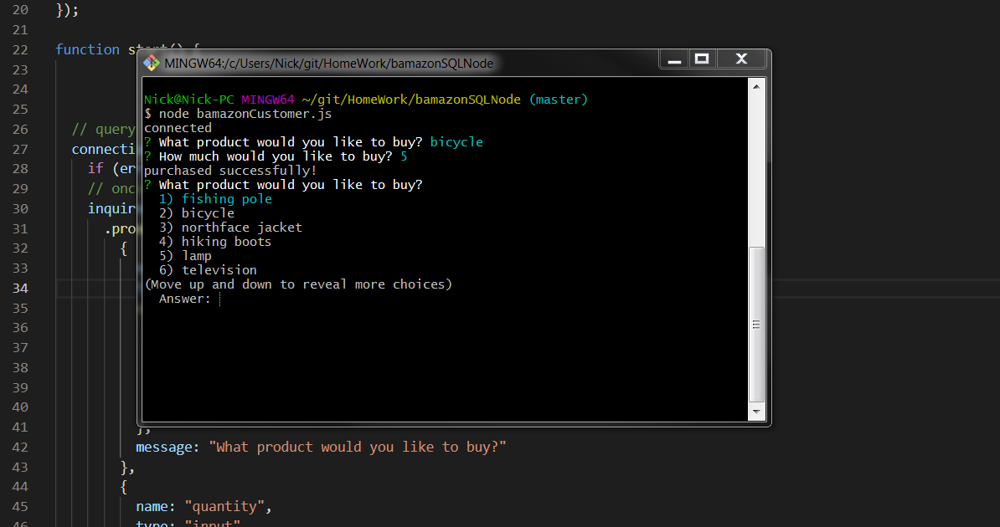
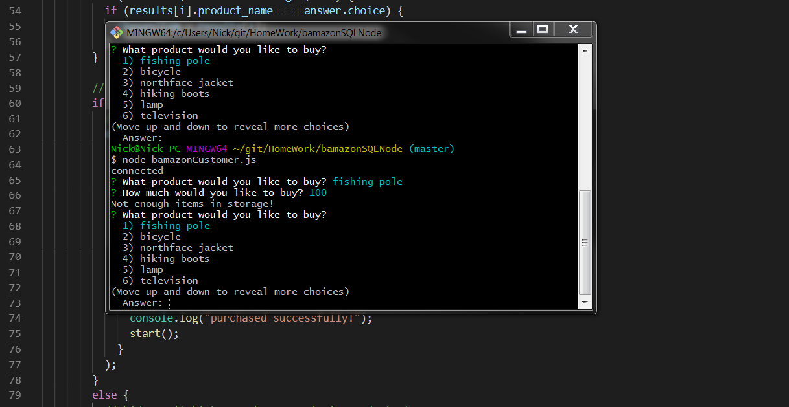

# bamazonSQLNode
# About / Synopsis

This app queries a sql database that is storing pre made products along with prices and quantities.  Based upon the user entry, they can change the quantity of any product unless the quantity total has reached 0.

# Table of contents

-Git Hub link: https://github.com/nickvenn/bamazonSQLNode.git 

# Installation

- npm install mysql
- npm install inquirer
- npm install body-parser

# Sample Run:
-node bamazonCustomer.js
 

## first prompt:

## second prompt:

## succesful purchase prompt:

## bad purchase prompt:

